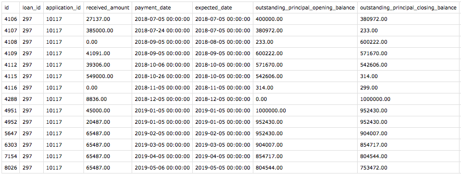

# reportsapi

# About
Reportsapi contains three apps: csvreport, chartreport and kendoreport. This API
was written using Django and Python's Pandas module, as a project assigned by [Gromor Finance](https://gromor.in/)
during my internship. I used it to generate statistical reports using the raw data
from the company's database.

Csvreport takes either a .csv file or a database table as input and generates reports in
the form of .csv files. A POST request must be sent to the api (using [Postman](https://www.getpostman.com/))
containing the necessary parameters and a downloadable .csv file is received as the output.
Similarly, both chartreport and kendoreport take either a .csv file or a database
table as input and embed a chart in a .html file. A POST request must be sent through
an ajax call and a script detailing the format of the charts and the data to be plotted
must be included in the success function of the ajax call. The variables received
in the API's response are passed into this script. The syntax of the scripts can be viewed in
`reportsapi/_examples/`.

Kendoreport was written to explore the possibility of integrating scrollable charts
to the company's loan software.

The Python scripts located in `reportsapi/_source/` are used to format the data into
reports. `utlis.py` contains multiple functions which were used to create customized
reports as per the company's requirements.

The API generates two types of reports:

## A Frequency table, or a table containing the specified columns

Frequency reports take a normalized table as input, generally containing multiple
instances of an item in different rows. For example, consider a table which has
logged the IDs of individuals who have visited/accessed the company's software and
the date and time of their visit [(See the example below)](https://github.com/hvrc/reportsapi#example-csv-report-visits-data).
The API will spit out a report indicating the number of times each individual has
visited/accessed the software in the form of a table. The parameters required for
each app are listed below:

```json
{
	"input": "",
	"type": "",
	"cols": []
}
```

`input`: The value must be the full path of a .csv file or it could be an array
of database details, viz., `[host, user, password, database, port]`.  
`type`: The value can either be `"frequency"` or **any** string other than `"frequency"`.  
`cols`: The value must be an array of column names. If the value of `type` is set to `"frequency"`,
then the first element of the array `cols` is used as the index and the frequencies
of the items in the column referred to by the second element of `cols`, are calculated.
If the value of `type` is set to anything other than `"frequency"`, a new table,
containing only the columns referred to in `cols` is created.  

---
# Run the API locally

Clone
```bash
$ git clone "https://github.com/hvrc/reportsapi.git"
$ cd reportsapi
```

Create a virtualenv & activate it
```bash
$ python3 -m venv venv
$ . venv/bin/activate
```

Install requirements
```bash
(venv) $ pip install -r requirements.txt
```

Run
```bash
(venv) $ python manage.py runserver
```

## View the examples

Open a new tab in your Terminal,
```bash
$ cd _examples
$ python -m SimpleHTTPServer 8001
```

Open [localhost:8000](http://127.0.0.1:8000) in your browser and view the examples.

---
# Examples
Each of the following examples are located in `/reportsapi/_examples/`.

### Example CSV Report (Visits Data)

Consider a table which contains a log of the IDs of individuals who have visited/accessed
the company's software and the date and time of their visit.


A post request can be sent to the following url using Postman, containing the following json as
the body:

```
POST http://127.0.0.1:8000/api/csv
```

```json
{
	"input": "path/to/visits.csv",
	"type": "frequency",
	"cols": ["date_time", "full_name"]
}
```

Additionally, the dates in the .csv file used as input are formatted by adding the
following line in `reportsapi/_source/reporter.py`

```python
def getReport(df, cols, type="frequency"):
    df = formatDates(df, cols[0], "%d-%m-%Y") # <-- this is a function from utils.py which formats the dates
    return pd.DataFrame(...
```

After firing the request, a .csv file can be downloaded from Postman. It displays
the number of times each individual has visited the software on each day.


### Example CSV Report (Inflow Data)

Consider a table containing the inflow data of a company.



A post request can be sent in the same method as the previous example.

```
POST http://127.0.0.1:8000/api/csv
```
```json
{
	"input": "path/to/visits.csv",
	"type": "detach",
	"cols": ["payment_date", "outstanding_principal_opening_balance", "outstanding_principal_closing_balance"]
}
```

The following .csv file can be downloaded as the output.


### Example Chart Report (Visits Data)

The .csv file given as input is the same as the one in the first example.

An ajax call can be sent in the following format to generate a chart report. `data`
contains two extra keys: `width` and `height`, which specify the size of the chart
to be embedded in the .html file. The rest of the parameters are the same as those
in the CSV Report examples. The success function contains the script required to
generate a c3.js chart.

```javascript
$("document").ready(function() {

    $.ajax({
        type: "POST",
        url: "http://localhost:8000/api/chart/",
        dataType: "json",
        traditional: true,

        data: {
            "input": "path/to/visits.csv",
            // "input": [host, user, password, database, port],
            "type": "frequency",
            "cols": ["date_time", "full_name"],
            "width": 1200,
            "height": 300
        },

        success: function(response) {

            var chart = c3.generate({
                ...
            });
        }
    });
});

```

The following chart is generated and embedded in an .html file.


### Example Chart Report (Inflow Data)

The input .csv is the same as the one in the second example, and the ajax call sent
is similar to the one in the previous example.

```javascript
$("document").ready(function() {

    $.ajax({
        type: "POST",
        url: "http://localhost:8000/api/chart/",
        dataType: "json",
        traditional: true,

        data: {
            "input": "/reportsapi/_examples/_files/inflow.csv",
            // "input": [host, user, password, database, port],
            "type": "detach",
            "cols": ["payment_date", "outstanding_principal_opening_balance", "outstanding_principal_closing_balance"],
            "width": 1200,
            "height": 300
        },

        success: function(response) {

            var chart = c3.generate({
                ...
            });
        }
    });
});
```

The following chart is generated and embedded in an .html file.


### Example Kendo Report (POS Data)

Here, the .csv file used as input contains two columns only, displaying the date
and amount of the POS data (Outstanding Principal Opening Balance), over the span
of three years.


The ajax call sent is similar to the one in the previous examples. However, due to
the requirements of the syntax of the Kendo UI Stock Chart script, an array called
`series` containing the data to be plotted must be created.

```javascript
$("document").ready(function() {

    $.ajax({
        type: "POST",
        url: "http://localhost:8000/api/kendo/",
        dataType: "json",
        traditional: true,

        data: {
            "input": "path/to/pos.csv",
            // "input": [],
            "type": "detach",
            "cols": ["Date", "Amount"],
            "width": 1200,
            "height": 300
        },

        success: function(response) {

            var series = [];
            for (var i = 0; i < response.columns.length; i++) {
                series.push({
                    name: response.columns[i],
                    field: response.columns[i],
                    type: "line",
                    style: "smooth",
                    markers: { visible: false }
                });
            }

            $("#kendoPOS").kendoStockChart({
                ...
            });
        }
    });
});

```

The POS data is plotted in a scrollable chart format. As you zoom in, the x-axis
changes values and plots new points. This chart is embedded in an .html file.


